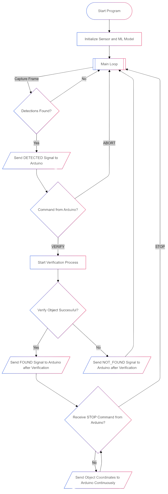

# Table of Contents

- [Controlflow](#cotrolflow)
- [Docs](#docs)
    - [Wichtige Zustände](#wichtige-zustände)
    - [Bibliotheken](#bibliotheken)
    - [Code-Übersicht](#code-übersicht)
        - [Initialisierung](#initialisierung)
        - [Model Setup](#model-setup)
        - [Erkennung und Verifikation](#erkennung-und-verifikation)
            - [Bildverarbeitung](#bildverarbeitung)
            - [Objektverifikation](#objektverifikation)
        - [Kommunikation mit dem Arduino](#kommunikation-mit-dem-arduino)
            - [Koordinaten senden](#koordinaten-senden)
            - [Statusnachrichten](#statusnachrichten)
        - [Asynchrone Kommunikation und Ablauf](#asynchrone-kommunikation-und-ablauf)

# Cotrolflow



# Docs

## Wichtige Zustände
| Konstante     | ByteValue | Beschreibung|
|---------------|-----------|-------------
| **DETECTED**  | `1`       |Ein Objekt wurde erkannt.                          |
| **VERIFY**    | `2`       |Eine Verifikation des Objekts wird angefordert.    |  
| **ABORT**     | `3`       |Die Verifikation wird abgebrochen.                 |
| **FOUND**     | `4`       |Das Objekt wurde erfolgreich verifiziert.          |
| **NOT_FOUND** | `5`       |Die Verifikation ist fehlgeschlagen.               |
| **CONTINUE**  | `6`       |Das System setzt die Erkennung fort.               |   
| **STOP**      | `7`       |Das System stoppt die Koordinatensendung.          |

## Bibliotheken

- `pyb`: Für die Interaktion mit der Pyboard-Hardware.
- `sensor`: Zum Steuern der Kamera.
- `image`: Zur Bildverarbeitung und Blob-Erkennung.
- `ml`: Für das Laden und Ausführen des TensorFlow Lite Modells.
- `uos`, `gc`: Für das Dateisystem und die Speicherkontrolle.
- `uasyncio`: Für asynchrone Aufgaben und zeitgesteuerte Operationen.

## Code-Übersicht

### Initialisierung

Zu Beginn werden die UART-Schnittstelle und die Kamera konfiguriert. Das maschinelle Lernmodell wird aus einer `.tflite`-Datei geladen und die Labels werden aus einer Datei `labels.txt` gelesen.

```python
uart = UART(3, 9600)
sensor.reset()
sensor.set_pixformat(sensor.RGB565)
sensor.set_framesize(sensor.QVGA)
sensor.set_vflip(False)

try:
    net = ml.Model("trained.tflite", load_to_fb=uos.stat('trained.tflite')[6] > (gc.mem_free() - (64 * 1024)))
except Exception:
    raise Exception("Error with tflite")

try:
    labels = [line.rstrip('\n') for line in open("labels.txt")]
except Exception:
    raise Exception("Error with labels.txt")
```

### Model Setup

Das Modell wird aus einer `.tflite`-Datei geladen, und falls es nicht genügend freien Speicher gibt, wird ein Fehler geworfen.

```python
net = ml.Model("trained.tflite", load_to_fb=uos.stat('trained.tflite')[6] > (gc.mem_free() - (64 * 1024)))
```

### Erkennung und Verifikation


#### Bildverarbeitung
`process_frame`verarbeitet jedes Kamerabild, um Objekte zu erkennen, und gibt eine Liste der erkannten Objekte zurück:

```python
def process_frame(net, img, min_confidence):
    detection_list = []
    for i, detection in enumerate(net.predict([img], callback=fomo_post_process)):
        if i == 0: continue
        if len(detection) == 0: continue
        for x, y, w, h, score in detection:
            if score >= min_confidence:
                center_x = math.floor(x + (w / 2))
                center_y = math.floor(y + (h / 2))
                detection_list.append((center_x, center_y, score, i))
    return detection_list
```

#### Objektverifikation
- `N_FRAMES` = Anzahl der Frames welche bei `verify_object_async` geprüft werden
- `MIN_FRAMES` = Anzahl der Frames welche bei `verify_object_async` positv sein müssen

`verify_object_async` ermöglicht dem System die Erkennung eines bestimmten Objekts zu verifizieren. Dies wird durch die Funktion durchgeführt, die sicherstellt, dass das erkannte Objekt auch weiterhin an der gleichen Position bleibt.

```python
async def verify_object_async(net, min_confidence, initial_label, initial_x, initial_y, n_frames=10, min_required_detection_count=8):
    detection_count = 0
    frame_count = 0
    while frame_count < n_frames:
        img = sensor.snapshot()
        detection_list = process_frame(net, img, min_confidence)
        for (center_x, center_y, score, label) in detection_list:
            if score >= min_confidence and label == initial_label:
                if abs(center_x - initial_x) < 20 and abs(center_y - initial_y) < 20:
                    detection_count += 1
        frame_count += 1
    return detection_count >= min_required_detection_count
```

### Kommunikation mit dem Arduino
#### Koordinaten senden

`send_coordinates_async` sendet die erkannten Koordinaten des Objekts:

```python
async def send_coordinates_async(x, y, label):
    message = bytearray([x >> 8, x & 0xFF, y >> 8, y & 0xFF, label])
    uart.write(message)
    await uasyncio.sleep(0.05)
```

#### Statusnachrichten

`send_to_arduino` sendet Statusnachrichten (`Koordinaten`,`Label`) an den Arduino:

```python
def send_to_arduino(message):
    uart.write(message)
    p9.high()
    time.sleep(0.05)
    p9.low()
```

### Asynchrone Kommunikation und Ablauf

`communication_and_detection` ist der Hauptsteuerfluss, der die Objekterkennung und -verifikation kombiniert und die Koordinaten an das Arduino sendet.

```python
async def communication_and_detection():
    possible = False
    initial_object = None
    initial_x = initial_y = None

    while True:
        img = sensor.snapshot()
        detection_list = process_frame(net, img, min_confidence)

        if detection_list:
            send_to_arduino(DETECTED)
            await uasyncio.sleep(0.05)

            if uart.any():
                command = uart.read().decode().strip()
                if command == str(VERIFY):
                    possible = True
                    initial_object = detection_list[0][3]
                    initial_x, initial_y = detection_list[0][0], detection_list[0][1]
                    print("Verifikation gestartet. Objekt erkannt.")
                elif command == str(ABORT):
                    possible = False

            if possible:
                if await verify_object_async(net, min_confidence, initial_object, initial_x, initial_y):
                    send_to_arduino(FOUND)
                    print("Verifikation erfolgreich.")
                    while True:
                        if uart.any():
                            command = uart.read().decode().strip()
                            if command == str(STOP):
                                print("Abbruchbefehl empfangen. Beende die Koordinatensendung.")
                                break
                        img = sensor.snapshot()
                        detection_list = process_frame(net, img, min_confidence)
                        for (center_x, center_y, score, label) in detection_list:
                            if label == initial_object and score >= min_confidence:
                                await send_coordinates_async(center_x, center_y, label)
                                await uasyncio.sleep(0.05)

                else:
                    send_to_arduino(NOT_FOUND)
                    print("Verifikation fehlgeschlagen.")
                possible = False
            else:
                send_to_arduino(CONTINUE)

    send_to_arduino(STOP)
```
