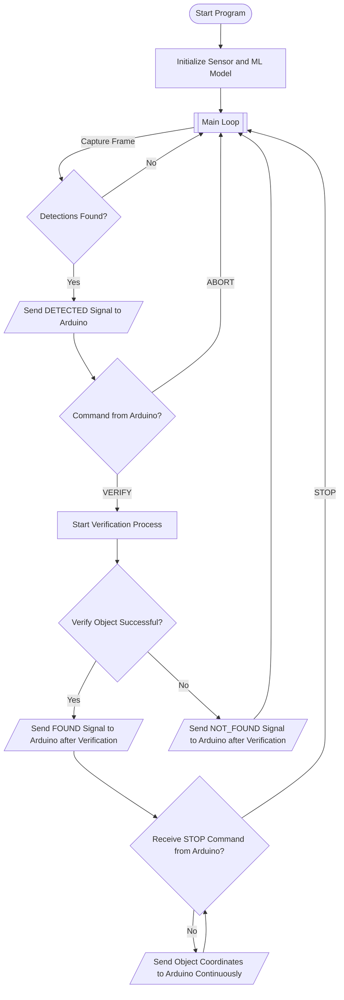

## Cotrolflow

```mermaid
flowchart TD
    A([Start Program]) --> B[Initialize Sensor and ML Model]
    B --> C[[Main Loop]]
    
    C -->|Capture Frame| D{Detections Found?}
    D -->|Yes| E@{shape: lean-r, label: "Send DETECTED Signal to Arduino"} --> F{Command from Arduino?}
    D -->|No| C
    
    F -->|VERIFY| G[Start Verification Process]
    F -->|ABORT| C

    G --> H{Verify Object Successful?}
    H -->|Yes| I@{shape: lean-r, label: "Send FOUND Signal to Arduino after Verification"} --> K{Receive STOP Command from Arduino?}
    H -->|No| J@{shape: lean-r, label: "Send NOT_FOUND Signal to Arduino after Verification"} --> C
    
    K -->|STOP| C
    K -->|No| L@{shape: lean-r, label: "Send Object Coordinates to Arduino Continuously"} --> K

```
## Docs
