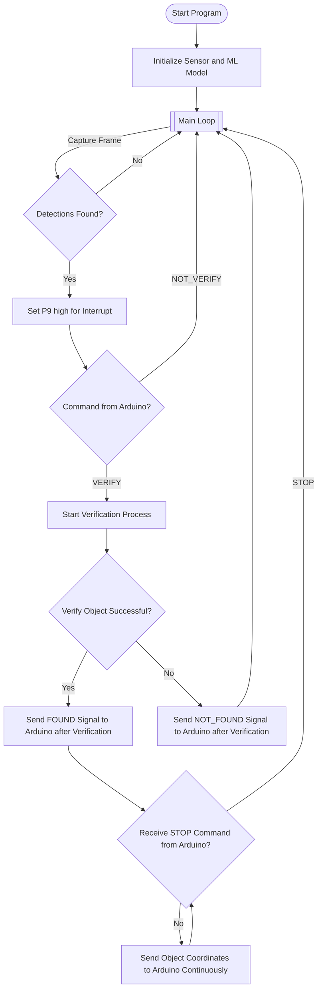

# OpenMV-RT1062

## Overview

This script is designed to perform object detection using a TensorFlow Lite model on an embedded system, communicate via UART, and handle asynchronous object verification and coordination. The primary flow includes:

1. Capturing images via the camera.
2. Performing object detection with a pre-trained model.
3. Verifying the detected object's location.
4. Communicating the coordinates and detection results over UART.

The system communicates with an external device using UART for commands such as VERIFY, ABORT, STOP, and others, while asynchronously processing object detection frames.

## Libraries

* **`time`**: Provides time-related functions for delays.
* **`machine`**: Contains hardware-related functions (e.g., UART, Pin control).
* **`math`**: Provides mathematical functions used in scaling and calculations.
* **`sensor`**: Provides camera interface for image capture and configuration.
* **`image`**: Image processing for object detection.
* **`uos`**: Used for file system operations, like checking file size.
* **`gc`**: Garbage collection (used for memory management).
* **`ml`**: Custom machine learning interface to load and run models.
* **`uasyncio`**: Asynchronous programming for non-blocking tasks like UART communication.

## Constants


| name             | usage                                                            | standart     |
| ---------------- | ---------------------------------------------------------------- | ------------ |
| `min_confidence` | min score which the object has to have to be considered detected | `0.95 = 95%` |
| `n_frames`       | how many frames are requiered for the verification function      | `10`         |
| `min_frames`     | how many frames have to contain an object in the verification    | `8`          |

## Setup

### UART Setup

```python
uart = UART(1, 9600)
```

* Initializes UART1 with a baud rate of 9600 to communicate with the Arduino Mega

### Camera Setup

```python
sensor.reset()
sensor.set_pixformat(sensor.RGB565)
sensor.set_framesize(sensor.QVGA)
sensor.set_vflip(False)
```

* Resets and configures the camera module to RGB565 color format and QVGA resolution.
* `set_vflip(False)` disables vertical flip for the camera feed. can be Changed if neede

### ML Model Setup

```python
net = ml.Model("trained.tflite", load_to_fb=uos.stat('trained.tflite')[6] > (gc.mem_free() - (64 * 1024)))
```

* Loads a pre-trained TensorFlow Lite model (`trained.tflite`) for object detection. The model is loaded into framebuffer if enough memory is available. Model got trained with Edge Impulse.

```python
labels = [line.rstrip('
') for line in open("labels.txt")]
```

* Reads and loads object labels from the `labels.txt` file.

### Colors & Thresholds

```python
colors = [(255, 0, 0), (0, 255, 0), (255, 255, 0), (0, 0, 255), (255, 0, 255), (0, 255, 255), (255, 255, 255)]
threshold_list = [(math.ceil(min_confidence * 255), 255)]
```

* Defines a list of colors for bounding box rendering. Used for debugging
* Defines the threshold for minimum confidence.

## Core Functions

### `fomo_post_process(model, inputs, outputs)`

This function handles the post-processing of object detection results from the model:

* It rescales the detected bounding boxes back to the original image dimensions.
* It calculates bounding box coordinates and confidence score.
* It returns the list of bounding boxes for each object detected.

### `process_frame(net, img, min_confidence)`

This function processes a single image frame:

* It performs object detection using the trained model.
* It filters detected objects based on the specified `min_confidence`.
* Returns a list of detected objects with their bounding box center coordinates, confidence score, and label.

### `verify_object_async(net, min_confidence, initial_label, initial_x, initial_y, n_frames=10, min_required_detection_count=8)`

This asynchronous function verifies the consistency of object detection over multiple frames:

* It captures `n_frames` images and counts the number of frames where the object is detected within a 20-pixel tolerance.
* If the object is consistently detected, the function returns `True`.

### `send_coordinates_async(x, y, label)`

This asynchronous function sends the detected object's coordinates and label over UART:

* It sends the data as a `bytearray` with the format: `[x_high, x_low, y_high, y_low, label]`.

### `send_to_arduino(message)`

This function sends a message (byte or bytearray) to the Arduino via UART:

* It sends the message byte-by-byte and briefly activates the `p9` pin to signal the message transmission.

### `communication_and_detection()`

The core function that controls the main flow:

* It captures frames from the camera and processes them.
* It waits for commands (`VERIFY`, `ABORT`, `STOP`) from the external device via UART.
* It handles the object verification process, sending coordinates to the Arduino when the object is verified.
* It continually sends updated coordinates of the object if the verification is successful, until a stop command is received.

## Main Control Flow





## Notes

* **Asynchronous Programming**: The code uses `uasyncio` to run non-blocking tasks, such as verifying objects and sending coordinates asynchronously.
* **Object Detection Accuracy**: The detection is filtered by `min_confidence`, which ensures that only objects with a high probability of being correctly identified are considered.
* **Communication Protocol**: UART is used to communicate between the embedded system and external devices, allowing the exchange of commands and data.

## License

This script is open-source and is distributed under the MIT License.
